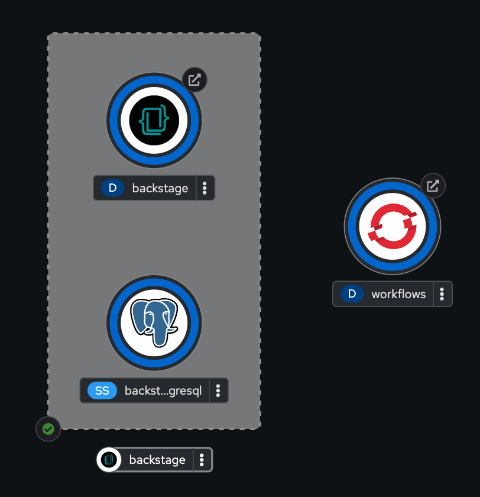

# orchestrator-setup

Instructions to set up the Orchestrator plugin in a new Backstage instance with some sample workflows. Be aware that this is not meant for production use-cases.

### Requirements
- OpenShift cluster (the free [Developer Sandbox](https://developers.redhat.com/developer-sandbox) can be used too)
- [OpenShift CLI](https://docs.openshift.com/container-platform/4.15/cli_reference/openshift_cli/getting-started-cli.html)
- [Helm CLI](https://helm.sh/docs/intro/install)

### Usage

#### Export the following required environment variables:

Name | Description
--- | ---
`OPENSHIFT_TOKEN` | The token to access your OpenShift Cluster instance.
`OPENSHIFT_SERVER` | The OpenShift server.
`OPENSHIFT_NAMESPACE` | The namespace where resources will be created.

#### Export the following optional environment variables for further customization:

Name | Description | Default value
--- | --- | ---
`WORKFLOWS_CONTAINER_IMAGE` | The container image of a Quarkus Project that contains workflows, embedded data index and job service. | `quay.io/caponetto/orchestrator-workflows:latest` ([project source](https://github.com/caponetto/orchestrator-workflows))
`GITHUB_TOKEN` | Since there is no GitHub auth provider set up, a token is necessary when interacting with Scaffolder actions that perform operations on GitHub. If you set a token, anyone who has access to the Backstage URL will be able to execute actions on the token owner's behalf (be careful). | `no-token`
`WORKFLOWS_RESOURCE_NAME` | Name of the resources associated with the workflows deployment. | `workflows`
`BACKSTAGE_RESOURCE_NAME` | Name of the resources associated with the Backstage deployment. | `backstage`
`HELM_CHART_CONFIG_YAML` | Configuration of the helm release (either local file or url). | `config.yaml`
`JANUS_HELM_CHART_VERSION` | Version of the Helm chart being used. The configuration might change in case other version is used ([chart source](https://github.com/redhat-developer/rhdh-chart)). | `2.14.0`

> **Note**: Edit the [config.yaml](config.yaml) file if you need to customize Backstage even further.

#### Grant permissions and execute the script
```bash
chmod +x setup.sh && ./setup.sh
```

#### Access the Backstage instance

Wait for Backstage pod to be ready and access its route.

<p align="center">
  
</p>

> **Note**: Initially, there will be two pods for the Backstage deployment because additional environment variables are set after the deployment is created. The first pod will throw an error and eventually terminate.

### Customizing the workflows

The default value for the `WORKFLOWS_CONTAINER_IMAGE` environment variable is a container image that contains some sample workflows. If you want to customize the workflows, proceed with following:

1. Fork the [orchestrator-workflows](https://github.com/caponetto/orchestrator-workflows) repository.
1. In your fork, set up your Quay CLI password as a secret named `QUAY_PASSWORD`.
1. Clone your fork and make the necessary changes to the workflows.
1. Run the project locally and test the changes.
1. Push the changes back to your fork (preferably via Pull request). The GitHub workflow will build a container image and push it to your Quay account with the `pr-X` tag, where `X` is the number of the PR. You can validate your container image using the `pr-X` tag before merging it, if you prefer.
1. Once you merge the PR, the GitHub workflow will build the image again and push 2 tags (`latest` and one for the commit hash).
1. From now on, you can set up the `WORKFLOWS_CONTAINER_IMAGE` environment variable with your container image.

> **Note**: You can also use different container registries. In this case, you will need to build the image locally and push it to the registry.
